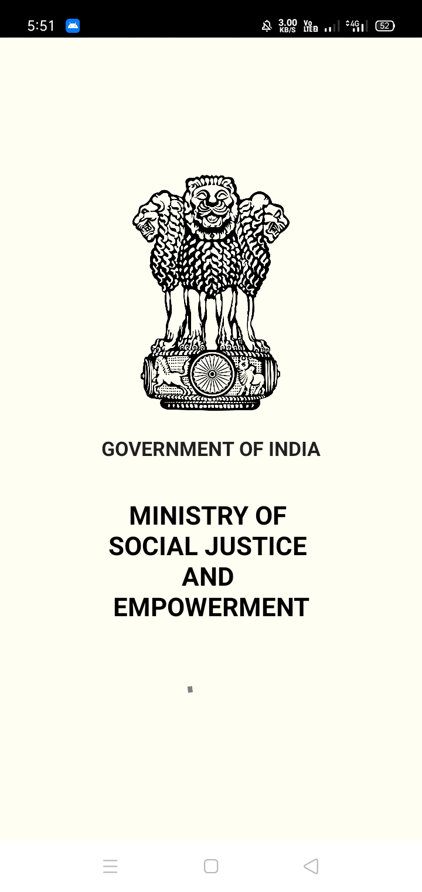
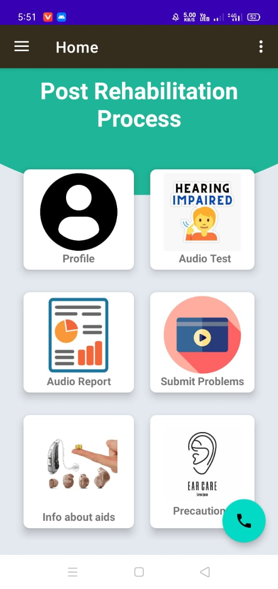
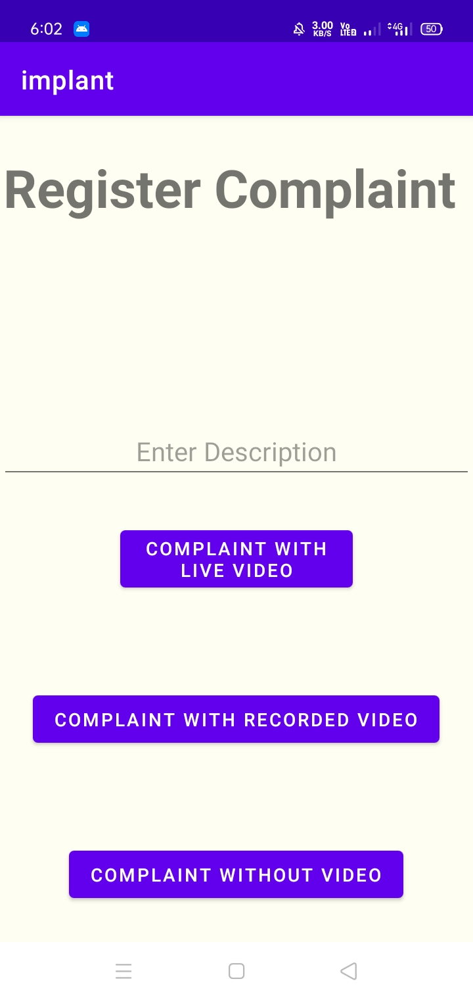
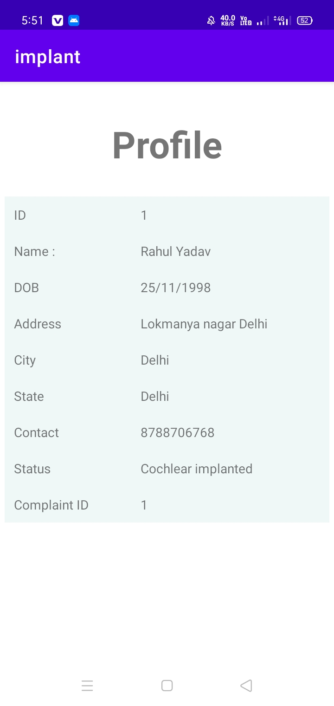
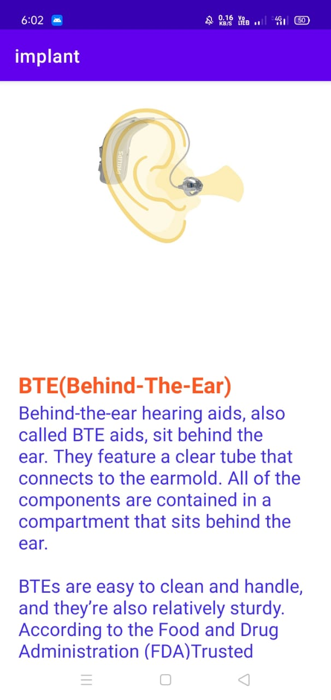
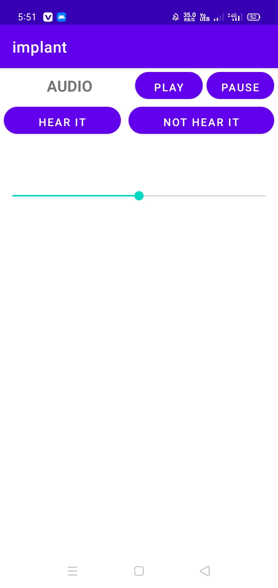

# Implant
Screenshots
---

## Problem Statement

**Background: Application to keep track of beneficiaries under ADIP CI Scheme of MSJ & ESummary: The ADIP CI Scheme of MSJ & E has a huge number of beneficiaries presently i.e. around 3,900 and looks forward to many more in future. Hence, keeping track with the beneficiary’s progress needs software developed which can connect patients and implementing agencies regularly. An Interactive voice response system is needed for regularly monitoring and generating post-operative rehabilitation status of ADIP CI beneficiaries. Objective: Interactive voice response system is needed for regularly monitoring and generating post-operative rehabilitation status of ADIP CI beneficiaries. Mobile Application with voice response system**

## Mission

**To empower Persons with Disabilities, through its various Acts/ Institutions/Organizations and Schemes for rehabilitation and to create an enabling environment that provides such persons with equal opportunities, protection of their rights and enables them to participate as independent and productive members of society.**
*ADIP CI beneficiaries Can Resolve Their All Queries by using This Application through voice response system.
*Department of Empowerment of Persons with Disabilities(Divyangjan) also Able to  keep track with the beneficiary’s progress.
*An Interactive voice response system for regularly monitoring and generating post-operative rehabilitation status of ADIP CI beneficiaries.

